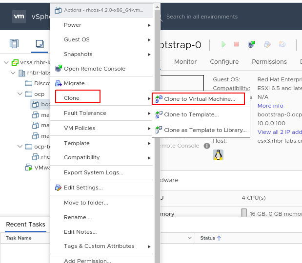
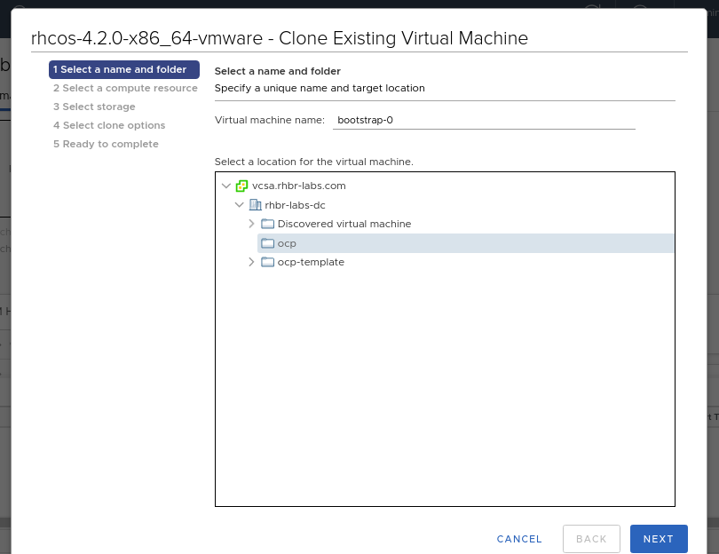
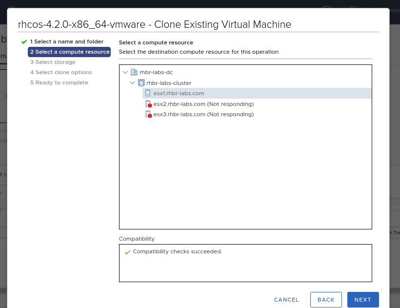
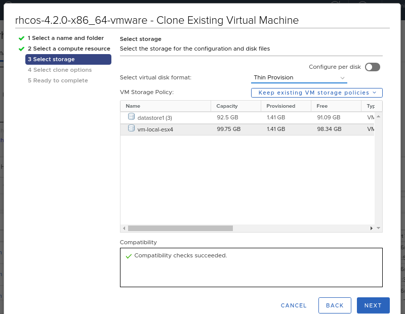
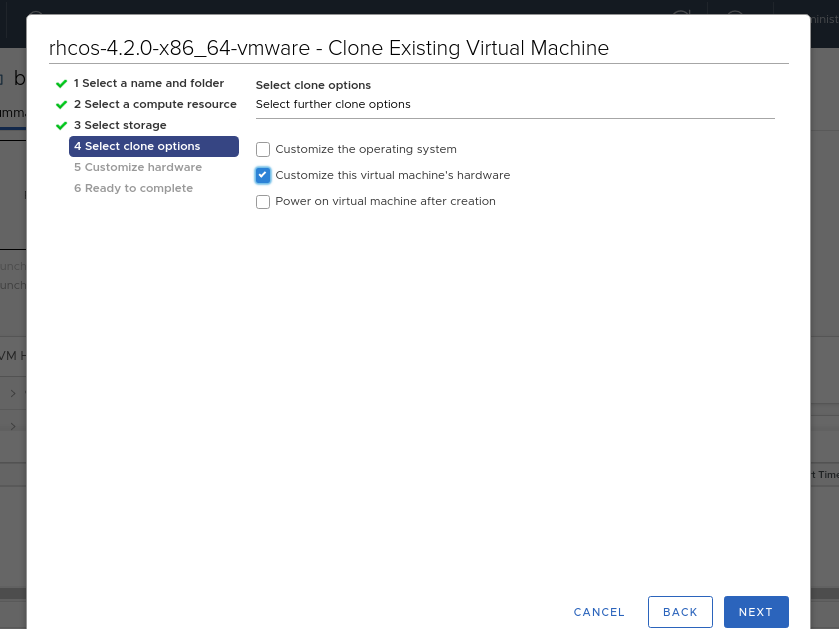
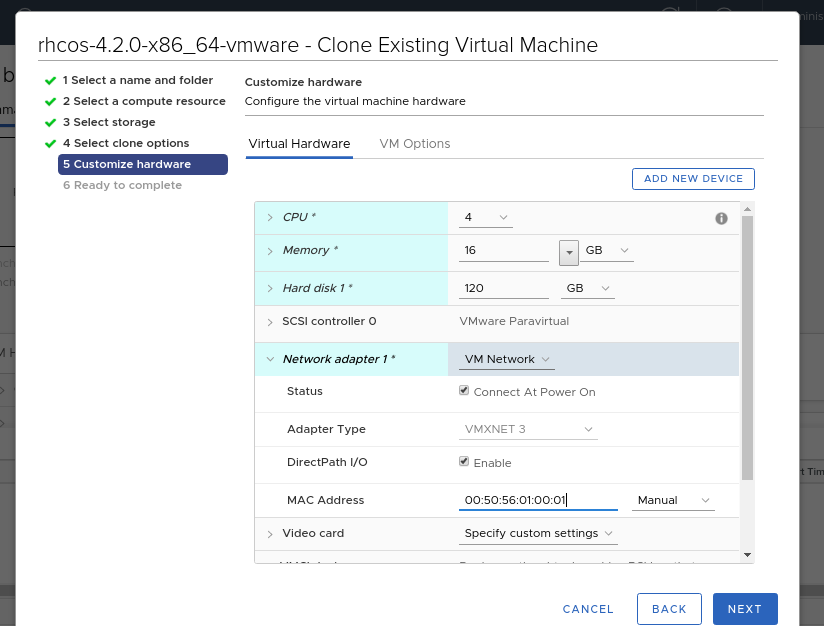
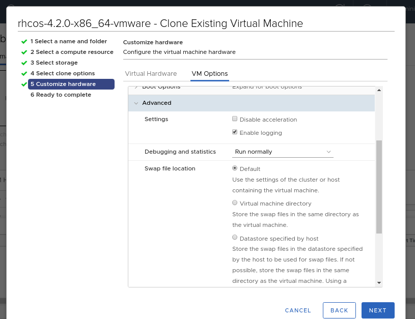
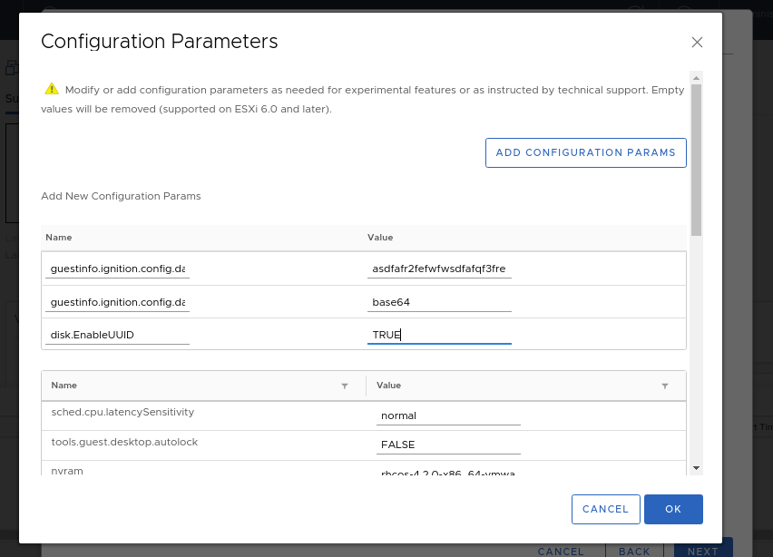
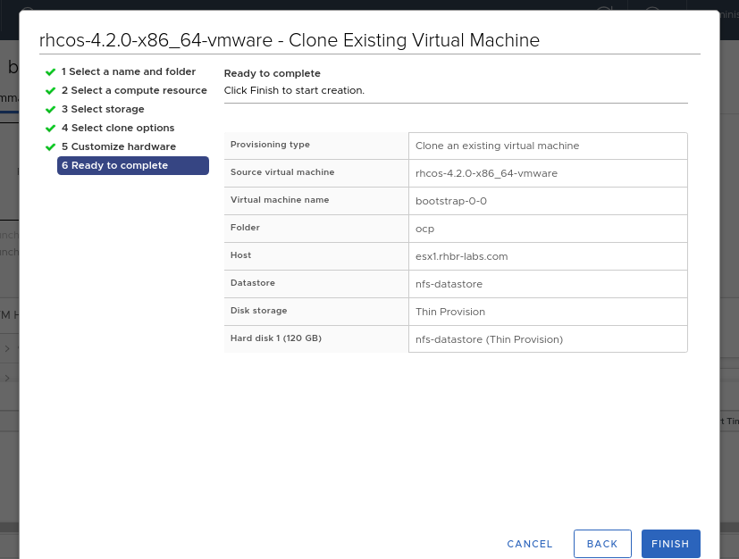

### Deploying the Cluster on vSphere

Access the vCenter web ui:
----
https://vcsa.rhbr-labs.com
User: administrator@vsphere.local
Password: <admin_password>
----

#### Provision OpenShift Servers

Right click on the OVA and select *Clone -> Clone to VM*

Select the folder you created before, input the vm name and click NEXT. Note that the vm name must be the same you have in your DHCP and DNS.

----
Folder: ocp<GUID>
VM Name: bootstrap-0
----

Select the compute resource and click NEXT:

Select the datastore and select disk format as *"Thin Provision"*:

Enable the option *"Customize this virtual machine's hardware"*

In the next screen input the following parameters:

----
CPU: 4
Memory: 16 GB
- Enable "Reserve all guest memory" option
Hard Disk 1: 120 GB
Network Adapter 1:
- MAC Address: Manual - <MAC ADDRESS WILL BE GIVEN BY THE INSTRUCTOR>
----

Click in *"VM Options"* tab and expand *"Advanced"* accordion:

In *"Latency Sensitivity"* select High and click in *"Edit Configuration..."* button.

Click in the *"ADD CONFIGURATION PARAMS"* button and add the following paramters:

----
guestinfo.ignition.config.data=<content of bootstrap.64 file>
guestinfo.ignition.config.data.encoding=base64
disk.EnableUUID=TRUE
----

Click in NEXT and FINISH to create the bootstrap machine.

*Repeat the same process above for VMs master-0 and worker-0. Use the following data:*

[cols="3,2,2,2,5",options=header]
|===
|MACHINE
|vCPU
|RAM
|STORAGE
|guestinfo.ignition.config.data

|master-0
|4
|16 GB
|120 GB
|Output of: cat master.64

|worker-0
|2
|8 GB
|120 GB
|Output of: cat worker.64

|===

*Now boot the all the VMs.*

#### Following the installation process

After you boot the VMs, run the command below to follow the bootstrap process:

----
[user0@infra-services ocp]$ openshift-install wait-for bootstrap-complete --log-level debug
DEBUG OpenShift Installer v4.2.0
DEBUG Built from commit 90ccb37ac1f85ae811c50a29f9bb7e779c5045fb
INFO Waiting up to 30m0s for the Kubernetes API at https://api.ocp.rhbr-labs.com:6443...
INFO API v1.14.6+2e5ed54 up
INFO Waiting up to 30m0s for bootstrapping to complete...
DEBUG Bootstrap status: complete
INFO It is now safe to remove the bootstrap resources
----

After you get the above INFO message, the bootstrap machine can be safely removed. 

This process can take up to 20 minutes. If you don't get this message, see some troubleshooting tips here link:troubleshooting.adoc[]!

After bootstrap competition, run the following command to check the installation progress:

----
[user0@infra-services ocp]$ openshift-install wait-for install-complete --log-level debug
DEBUG OpenShift Installer v4.2.10                  
DEBUG Built from commit 6ed04f65b0f6a1e11f10afe658465ba8195ac459 
INFO Waiting up to 30m0s for the cluster at https://api.ocp.rhbr-labs.com:6443 to initialize... 
DEBUG Still waiting for the cluster to initialize: Working towards 4.2.10: 99% complete, waiting on authentication, console, image-registry 
DEBUG Still waiting for the cluster to initialize: Working towards 4.2.10: 99% complete, waiting on authentication, console, image-registry 
DEBUG Still waiting for the cluster to initialize: Working towards 4.2.10: 100% complete 
DEBUG Cluster is initialized                       
INFO Waiting up to 10m0s for the openshift-console route to be created... 
DEBUG Route found in openshift-console namespace: console 
DEBUG Route found in openshift-console namespace: downloads 
DEBUG OpenShift console route is created           
INFO Install complete!                            
INFO To access the cluster as the system:admin user when using 'oc', run 'export KUBECONFIG=/home/user0/ocp/auth/kubeconfig' 
INFO Access the OpenShift web-console here: https://console-openshift-console.apps.ocp.rhbr-labs.com 
INFO Login to the console with user: kubeadmin, password: YsviS-yGfBx-t6FsV-BZ58B 
----

#### Running oc commands

Configure kube config in your profile to be able to run oc commands:

----
mkdir ~/.kube/
cp auth/kubeconfig ~/.kube/config
----

#### Following cluster operators deployment

During 

----
[user0@infra-services ocp]$ watch -n 10 'oc get clusteroperators'
Every 10.0s: oc get clusteroperators                                                                                                                                                                                                infra-services.rhbr-labs.com: Mon Dec 16 20:43:44 2019

NAME                                       VERSION   AVAILABLE   PROGRESSING   DEGRADED   SINCE
authentication                                       Unknown     Unknown       True	  3m1s
cloud-credential                           4.2.10    True        False         False	  6m54s
console                                    4.2.10    Unknown     True          False	  11s
dns                                        4.2.10    True        False         False	  6m20s
image-registry                                       False	 False         True	  11s
ingress                                    unknown   False	 True          False	  11s
insights                                   4.2.10    True        False         False	  6m53s
kube-apiserver                             4.2.10    True        False         False	  4m24s
kube-controller-manager                    4.2.10    True        False         False	  4m18s
kube-scheduler                             4.2.10    True        False         False	  4m16s
machine-api                                4.2.10    True        False         False	  6m56s
machine-config                             4.2.10    True        False         False	  6m18s
marketplace                                          False	 True          False	  12s
monitoring                                           Unknown     True          Unknown    14s
network                                    4.2.10    True        False         False	  5m57s
node-tuning                                4.2.10    True        False         False	  2m50s
openshift-apiserver                        4.2.10    True        False         False	  2m9s
openshift-controller-manager               4.2.10    True        False         False	  3m7s
openshift-samples                                    False	 False                    9s
operator-lifecycle-manager                 4.2.10    True        False         False	  5m52s
operator-lifecycle-manager-catalog         4.2.10    True        False         False	  5m52s
operator-lifecycle-manager-packageserver   4.2.10    True        False         False	  3m7s
service-ca                                 4.2.10    True        False         False	  6m46s
service-catalog-apiserver                  4.2.10    True        False         False	  2m57s
service-catalog-controller-manager         4.2.10    True        False         False	  3m
----