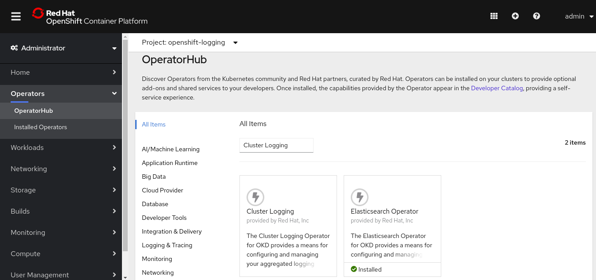
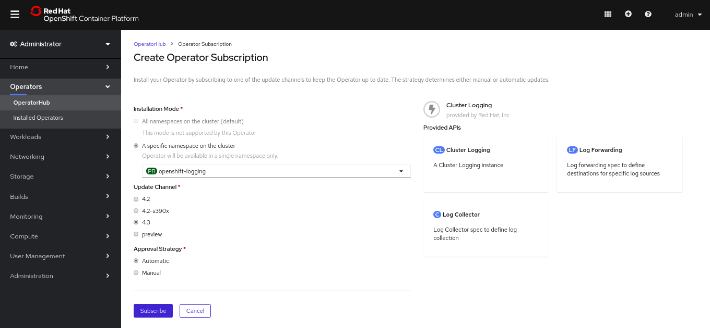
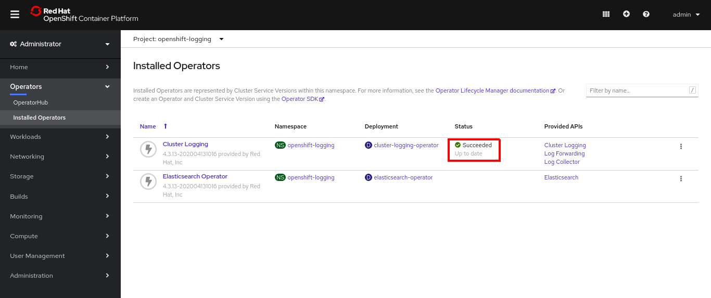
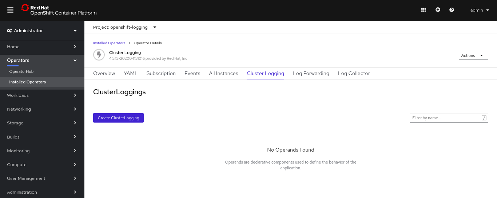
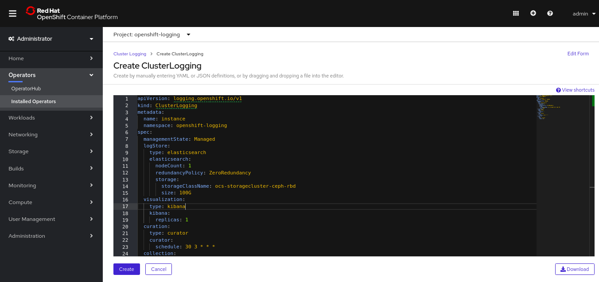
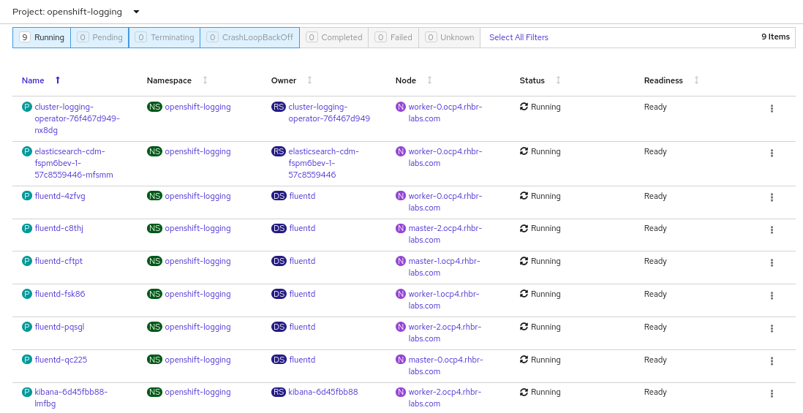
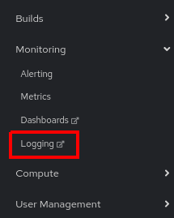
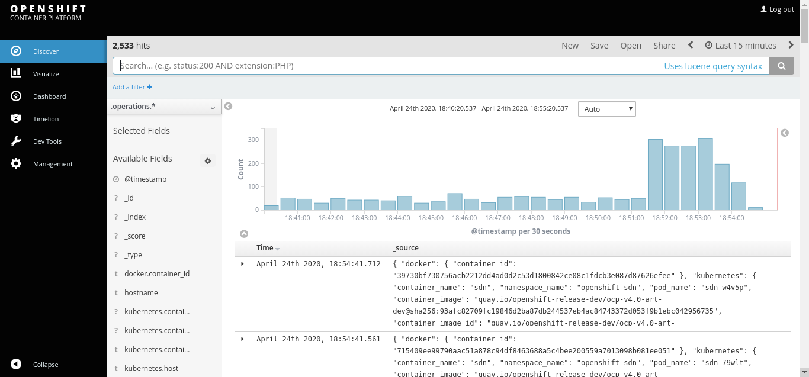

= Workshop Hands-on - Deploy OCP 4.x UPI on vSphere

=== Cluster Logging Deployment
The Red Hat OpenShift includes a Logging Agregation tool based on Elasticsearch, FluentD and Kibana. Its installation is optional, but recommended in case your organization does not have any other logging solution already in place.

The deployment is very straightforward. Run the commands below in a terminal with oc (run `oc login` first using a cluster-admin user).

For more information check the link:https://docs.openshift.com/container-platform/4.3/logging/cluster-logging-deploying.html[official documentation].

----
# Create the openshift-operators namespace
cat <<EOF > eo-namespace.yaml
apiVersion: v1
kind: Namespace
metadata:
  name: openshift-operators-redhat 
  annotations:
    openshift.io/node-selector: ""
  labels:
    openshift.io/cluster-monitoring: "true" 
EOF

oc create -f eo-namespace.yaml

# Create the OperatorGroup
cat <<EOF > eo-og.yaml
apiVersion: operators.coreos.com/v1
kind: OperatorGroup
metadata:
  name: openshift-operators-redhat
  namespace: openshift-operators-redhat 
spec: {}
EOF

oc create -f eo-og.yaml

# Create the ES subscription
cat <<EOF > eo-sub.yaml
apiVersion: operators.coreos.com/v1alpha1
kind: Subscription
metadata:
  name: "elasticsearch-operator"
  namespace: "openshift-operators-redhat" 
spec:
  channel: "4.3" 
  installPlanApproval: "Automatic"
  source: "redhat-operators" 
  sourceNamespace: "openshift-marketplace"
  name: "elasticsearch-operator"
EOF

oc create -f eo-sub.yaml

# Configure the project RBAC
oc project openshift-operators-redhat

cat <<EOF > eo-rbac.yaml
apiVersion: rbac.authorization.k8s.io/v1
kind: Role
metadata:
  name: prometheus-k8s
  namespace: openshift-operators-redhat
rules:
- apiGroups:
  - ""
  resources:
  - services
  - endpoints
  - pods
  verbs:
  - get
  - list
  - watch
---
apiVersion: rbac.authorization.k8s.io/v1
kind: RoleBinding
metadata:
  name: prometheus-k8s
  namespace: openshift-operators-redhat
roleRef:
  apiGroup: rbac.authorization.k8s.io
  kind: Role
  name: prometheus-k8s
subjects:
- kind: ServiceAccount
  name: prometheus-k8s
  namespace: openshift-operators-redhat
EOF

oc create -f eo-rbac.yaml

# Deploy Cluster Logging Operator
cat <<EOF > clo-namespace.yaml
apiVersion: v1
kind: Namespace
metadata:
  name: openshift-logging 
  annotations:
    openshift.io/node-selector: "" 
  labels:
    openshift.io/cluster-monitoring: "true" 
EOF

oc create -f clo-namespace.yaml
----

After you created the objects above, deploy the ClusterLogging operator using the web console:

. Click in *Operators -> OperatorHub* and search for `Cluster Logging` operator:

.OperatorHub

[start=2]
. Choose the `Cluster Logging` operator and click in the `Install` button.
. On the next screen select `openshift-logging` as the namespace and click in `Subscribe`.

.Operator Subscription

[start=4]
. Wait until you see the status `Succeeded` in the Status column.

.Subscription Succeeded

[start=5]
. Now click on the `Cluster Logging` link and navigate to the `Cluster Logging` tab.
. Click in the `Create ClusterLogging` button.

.Create Cluster Logging Instance

The following screen will be presented:

.Create Cluster Logging Instance Details

[start=7]
. Fill up the cluster settings you want to create. Below are two examples of common configurations for ClusterLogging:

*Cluster Logging in HA (3 ES instances)*:
----
apiVersion: "logging.openshift.io/v1"
kind: "ClusterLogging"
metadata:
  name: "instance" 
  namespace: "openshift-logging"
spec:
  managementState: "Managed"  
  logStore:
    type: "elasticsearch"  
    elasticsearch:
      nodeCount: 3 
      storage:
        storageClassName: gp2 
        size: 200G
      redundancyPolicy: "SingleRedundancy"
  visualization:
    type: "kibana"  
    kibana:
      replicas: 1
  curation:
    type: "curator"  
    curator:
      schedule: "30 3 * * *"
  collection:
    logs:
      type: "fluentd"  
      fluentd: {}
----

*Cluster Logging single instance*:
----
apiVersion: logging.openshift.io/v1
kind: ClusterLogging
metadata:
  name: instance
  namespace: openshift-logging
spec:
  managementState: Managed
  logStore:
    type: elasticsearch
    elasticsearch:
      nodeCount: 1
      redundancyPolicy: ZeroRedundancy
      storage:
        storageClassName: ocs-storagecluster-ceph-rbd
        size: 100G
  visualization:
    type: kibana
    kibana:
      replicas: 1
  curation:
    type: curator
    curator:
      schedule: 30 3 * * *
  collection:
    logs:
      type: fluentd
      fluentd: {}
----

[start=8]
. Click in the `Create` button and wait until all pods are spined up. You will see one pod for cluster logging operator, one for each ES instance you setup in the yaml file, one fluentd pod for each existing node and one pod for kibana.

.Deployment finished

[start=9]
. After Logging deployment you will see a new option in the `Monitoring` menu:

.Logging menu

[start=10]
. This link takes the user to the Kibana UI:

.Kibana UI

