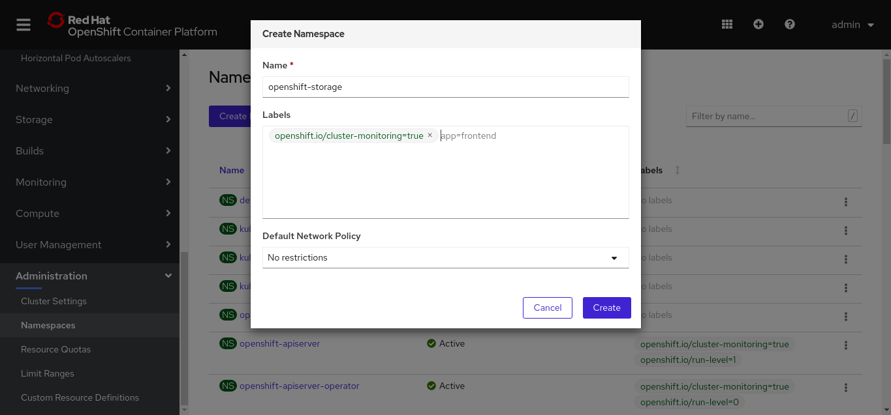
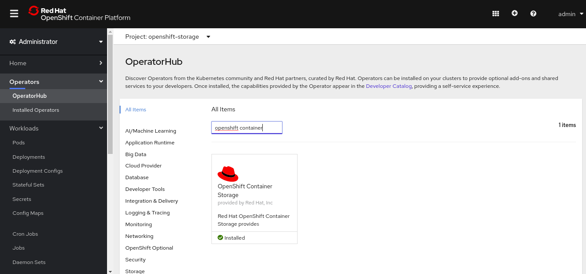
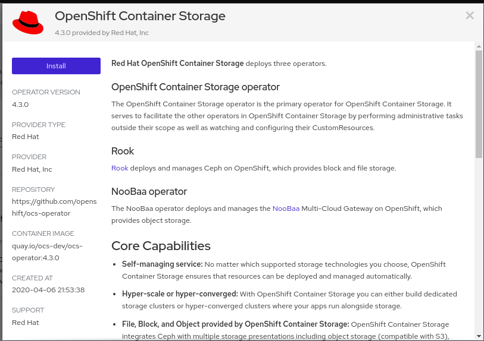
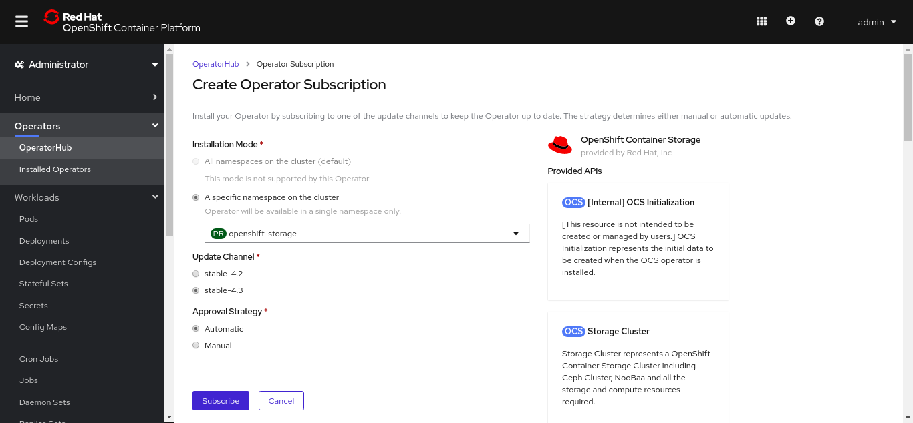
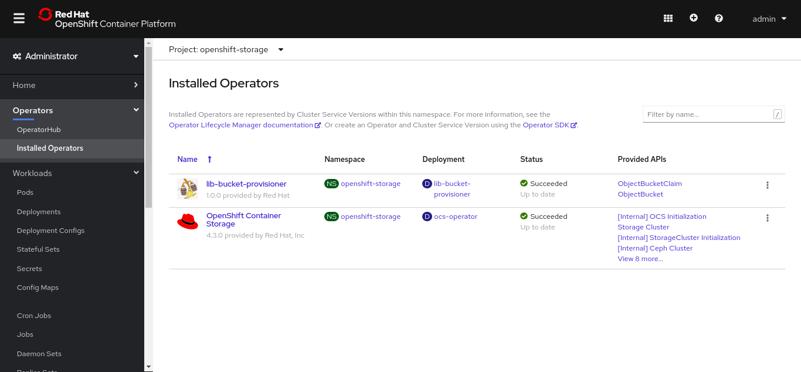
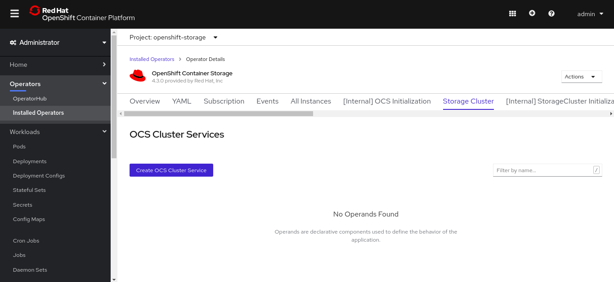
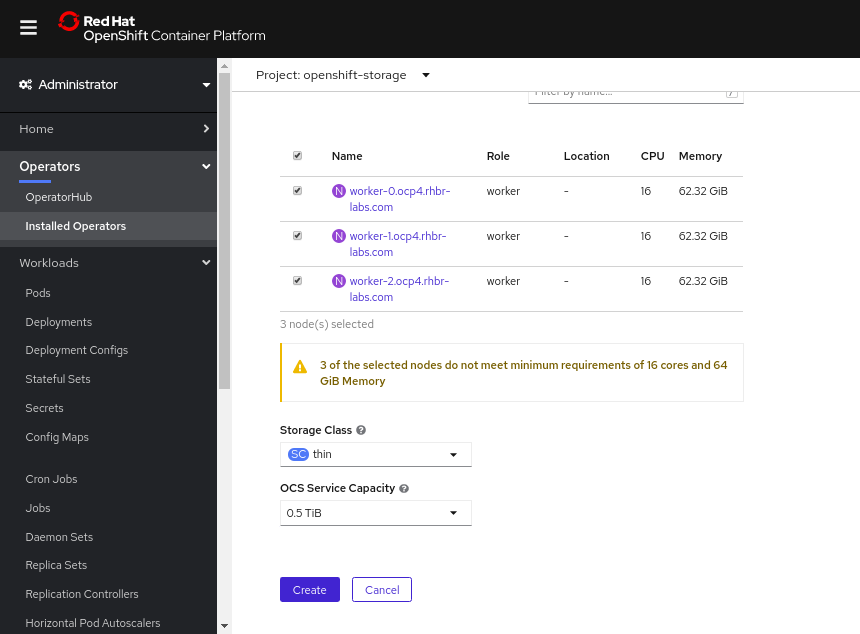
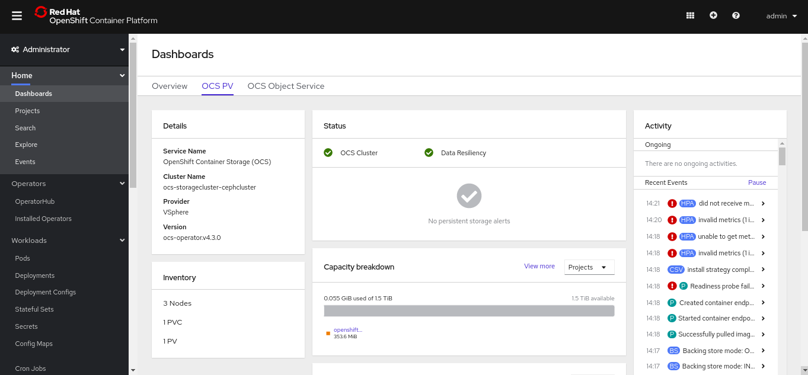

= Workshop Hands-on - Deploy OCP 4.2 on vSphere

=== OpenShift Container Storage 4.x Deployment

The Red Hat OpenShift Container Storage (OCS) adds the dynamic provisioning capability for the following storage options for your containers: 

* Shared Storage using `cephfs` [for *RWX* volumes]
* Object Storage using `noobaa` [for *RWX* volumes]
* Block Storage using `ceph rbd` [for *RWO* volumes]

This section explains how to deploy the OCS 4.x on top of an OpenShift 4 cluster. For more information check the link:https://access.redhat.com/documentation/en-us/red_hat_openshift_container_storage/4.3/html/deploying_openshift_container_storage/index[official documentation].

==== Pre Requisites

For OCS installation you need to have at least 3 worker nodes with 16 vCPU, 64 GB RAM and at least 0.5 TB of disk already available in the cluster. Check this link:https://access.redhat.com/documentation/en-us/red_hat_openshift_container_storage/4.3/html-single/planning_your_deployment/index[document] to see more information about the requirements.

==== Deployment

The OCS is managed by an Operator. Its installation process is described bellow.

. Create a new namespace named `openshift-storage` for the OCS either using `oc` command or using the web console. Use the label `openshift.io/cluster-monitoring=true` in the namespace.

.Create namespace

[start=2]
. Access the OperatorHub (*Operators -> OperatorHub*)
. Search for *OpenShift Container Storage*

.OCS operator

[start=4]
. Click in the `Install` button

.Install the operator

[start=5]
. Select `openshift-storage` in the namespace
. Select the desired version
. Select the Approval Strategy
. Click in `Subscribe` button

.Subscribe

[start=9]
. Wait until you get the `lib-bucket-provisioner` and `OpenShift Container Storage` operators in the *Succeeded* status.

.Succeeded status

[start=10]
. After that, click on the `OpenShift Container Storage` link.
. Click in the `Storage Cluster` tab.
. Click in the `Create OCS Cluster Service` button.

.Create OCS Cluster Service

[start=13]
. In the next screen select the worker nodes that will be configured as OCS storage nodes.
. Select the Storage Class that will be used to create the disks that OCS will use to provision the ceph OSDs.
. Select the service capacity.
. Click in the `Create` button.

.Input the OCS parameters

[start=17]
. Wait for OCS deployment. This process can take up to an hour.
. To check if the OCS cluster is available, check the status on the new `OCS PV` dashboard:

.OCS Status

[start=19]
. To check noobaa status, you can install noobaa cli and run the `noobaa status command`

----
curl -s https://api.github.com/repos/noobaa/noobaa-operator/releases/latest | grep "linux" | cut -d : -f 2,3 | tr -d \" | wget -qi - ; mv noobaa-linux-* noobaa ; chmod +x noobaa; sudo mv noobaa /usr/bin/
noobaa status -n openshift-storage
----
