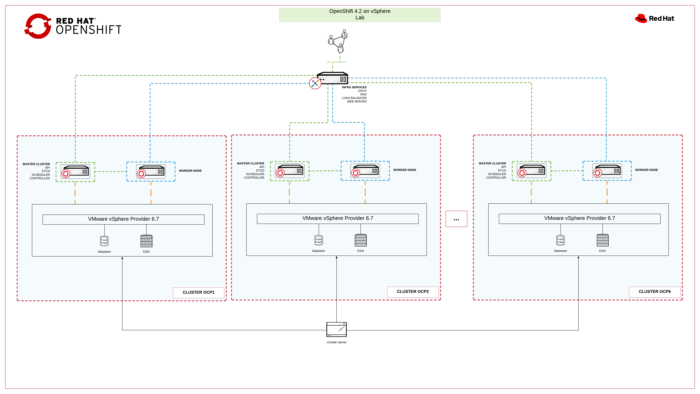

# Workshop Hands-on - Deploy OCP 4.2 on vSphere

### Overview

The OpenShift installation on vSphere is comprised of the following:

1. Prepare pre-requisites
2. Pre-requisites validation
3. Ignition files creation
4. Deploy on vSphere
5. Post deployment configuration

In this lab you will inspect in detail the pre-requisites and deploy a small cluster on vSphere from scratch.

### Lab Environment

This lab environment is built on Ravello and contains 6 ESXi with 16 vCPU and 64 GB. Each team will use its own ESXi and datastore to avoid concurrence problems.

image::images/overview-lab-env.png[Lab Environment on Ravello]

### Infra Services

A VM named infra-services has been set up with the following services for each cluster you will deploy:

- DHCP: DHCP is configured to provide ip and hostname for VMs of each cluster.
- DNS: Infra-services is the internal DNS, providing A/PTR and SRV records for each cluster.
- Webserver: A apache webserver is already configured in infra-services machine to host the ignition file for each cluster.
- HAProxy: Infra-services is configured with one public ip for each cluster. HAProxy is set up to balance requisitions from each ip to the corresponding cluster.

