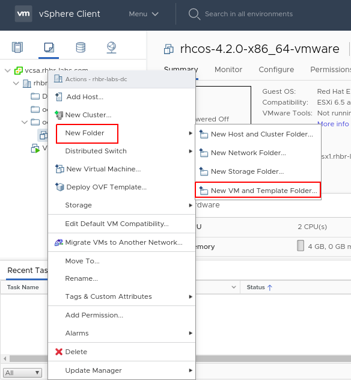
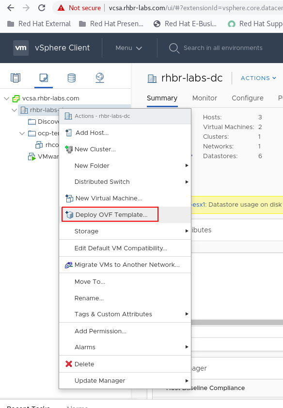
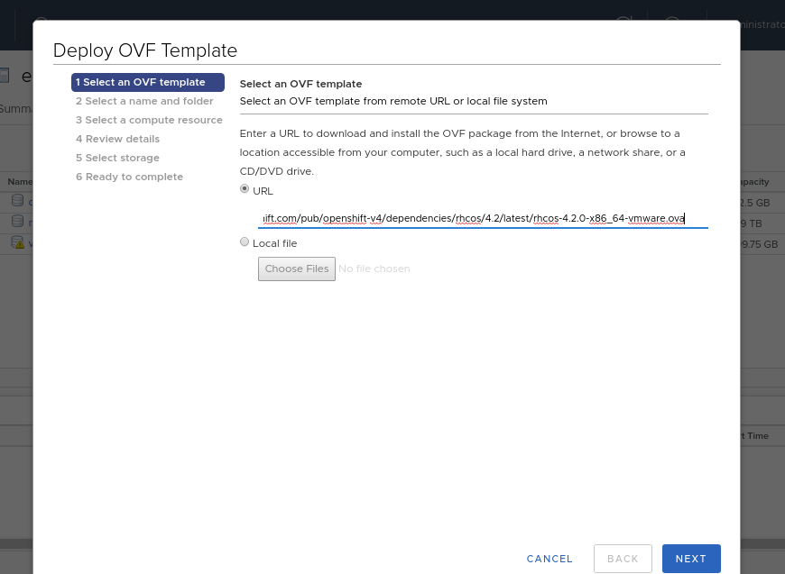
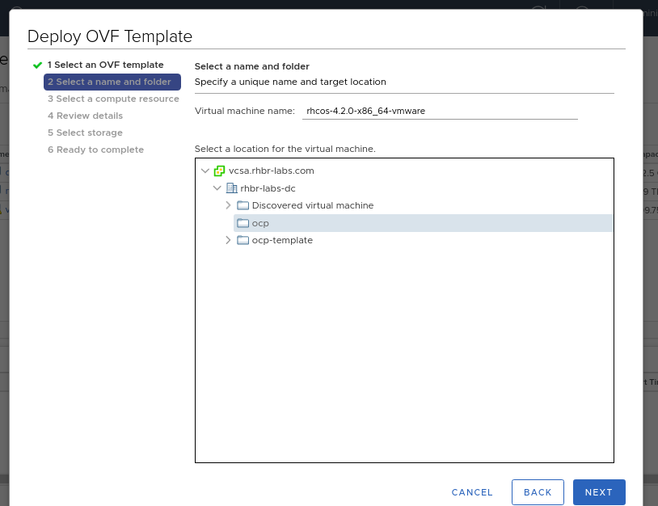
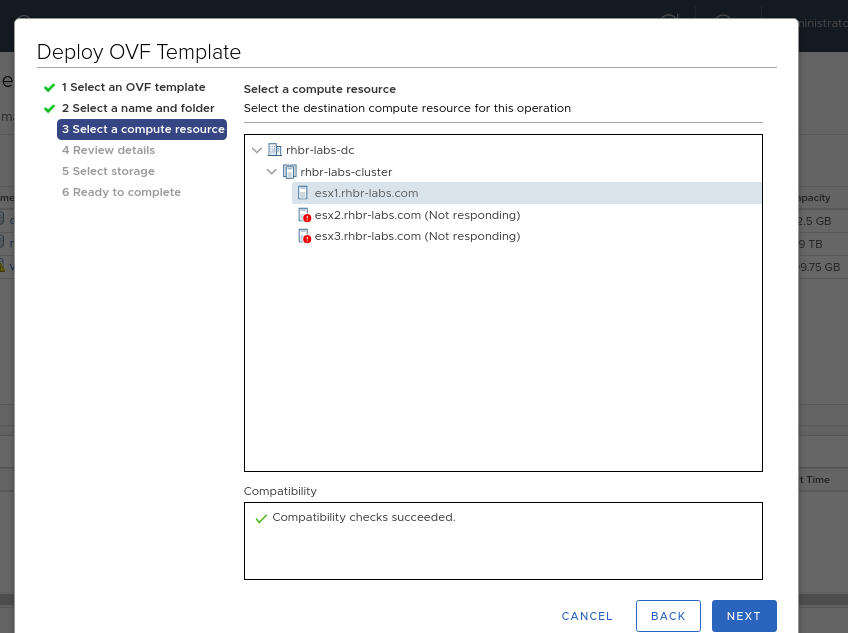
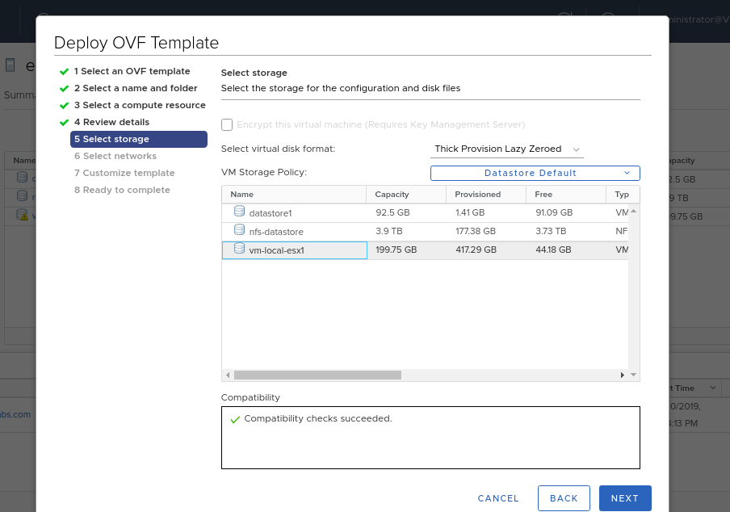
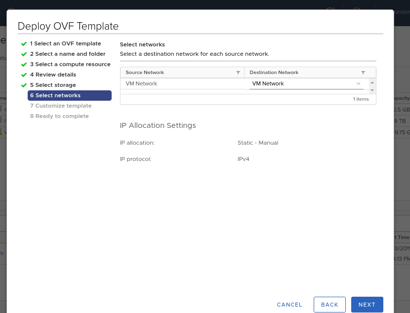
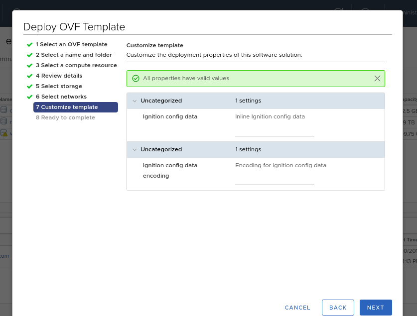
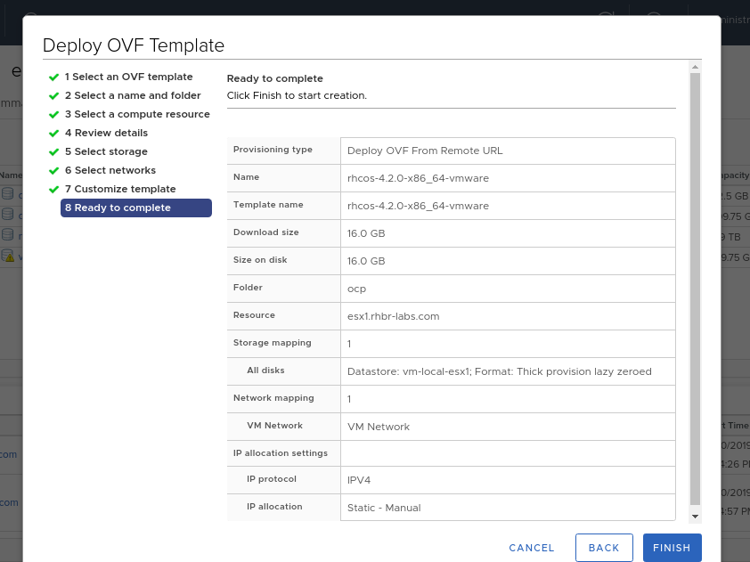

Access the vCenter web ui:
----
https://vcsa.rhbr-labs.com
User: administrator@vsphere.local
Password: <admin_password>
----

#### Import OVA Template

[NOTE]
====
Note 1: To save time, this OVA is has been already imported. The steps below is for reference only, use the template that is in "ocp-template" folder and skip the steps below.

Note 2: *NEVER, NEVER, NEVER start up the template*. The ignition process runs on first boot, so booting the template would mean any ignition files provided after that wouldn't be evaluated.
====

Navigate to “VMs and Templates” (it’s the icon that looks like a piece of paper). From here right click on your datacenter and select New Folder → New VM and Template Folder. Name this new folder the name of your cluster id: ocp<GUID>

Next, import the OVA by right clicking the folder and select “Deploy OVF Template”. 

Add the url to RHCOS OVA (https://mirror.openshift.com/pub/openshift-v4/dependencies/rhcos/4.2/latest/[see here]) and click on NEXT button:

Select the folder you created before and click on NEXT button:

Select the compute resource and click on NEXT button:

Select the datastore you filled in the installation conf file:

Select the network and click on NEXT button:

Don't fill anything yet (these parameters will be filled further). Click NEXT.

Click em Finish in the next screen

